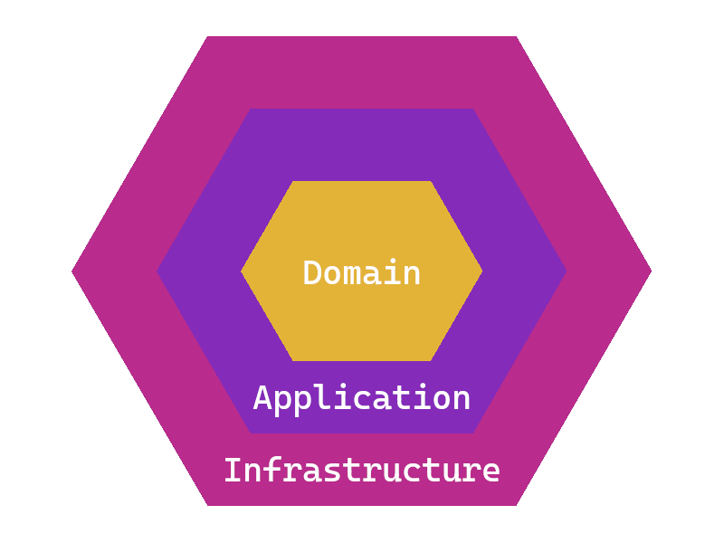

# Template Typescript & Express
There are many ways to create a REST API in Node.js, and whenever I start a new project, I think about how I'm going to do it—what tools to use, which architecture to implement, among other things. In this template, I have combined the best possible tools (personal criteria) along with the use of best practices to create a maintainable and scalable project.

### Tabla de contenido
- [What is hexagonal architecture?](#what-is-hexagonal-architecture)
  - [Why use it?](#why-use-it)
- [Tools used](#tools-used)
- [How to run the project?](#how-to-run-the-project)
  - [Prerequisites](#prerequisites)
  - [Environment variables](#environment-variables)
  - [Docker execution](#docker-execution)
  - [Migrations](#migrations)
  - [Testing](#testing)
  - [Documentation](#documentation)
  - [REST client](#rest-client)
- [Contributions](#contributions)

## What is hexagonal architecture?
As the name suggests, it is an architecture divided into hexagons—more specifically, three. Below is a diagram to help with understanding:

- Domain. This is the core of the hexagon, containing all the pure business logic. This is where entities, value objects, aggregates, and repository interfaces are defined. This layer can only communicate with itself and has no dependency on any other layer.
- Application. These are the use cases, the intermediary that coordinates operations between the domain and infrastructure. Business rules are applied here in response to events. This layer can only communicate with itself and the domain.
- Infrastructure. This layer implements the interfaces defined in the previous layers. It includes the adapters that interact with the database or any other external service. This layer manages the implementation of repositories, configurations, or other operational aspects.

The goal of using this architecture is to separate responsibilities. By doing so, if a change is needed in the future, it can be made without having to redo a large portion of the application.

### Why use it?
It offers order, consistency, and clarity in the code, as well as great maintainability and scalability of the project. By separating responsibilities, if at any point you need to change the development framework, database, or anything else, you only need to modify that part of the module. Additionally, the independence of the different sections of the project makes testing the application easier.

## Tools used
- [Typescript](https://www.typescriptlang.org/docs/). Provides a layer of safety and speed during development by adding types to JavaScript, making it more comfortable to work with.
- [Express](https://expressjs.com). A simple, useful, and probably the most well-known framework among Node.js developers.
- [Zod](https://zod.dev). Zod is a comprehensive library for data validation, written in TypeScript, which comes with built-in types.
- [Drizzle](https://orm.drizzle.team/docs/overview). Drizzle says it best—if you know SQL, you know Drizzle. It's very comfortable to use, offers a CLI, and is fast.
- [Winston](https://www.npmjs.com/package/winston). Very useful, flexible, customizable, and easy to integrate with other tools.
- [Jest](https://jestjs.io/docs/getting-started). Almost indispensable for unit testing in your application. It's easy to use, robust, and customizable.
- [Supertest](https://www.npmjs.com/package/supertest). A very simple and functional tool for testing an API, commonly used with Express.
- [Typedoc](https://typedoc.org/guides/installation/). If you know or have used JSDoc, you'll find Typedoc very easy to use. It generates most of the documentation based on TypeScript types.
- [Swagger](https://www.npmjs.com/package/swagger-jsdoc). Some frameworks integrate it by default. It's simple to use and one of the best tools for documenting and testing an API, making it very helpful for client-side developers.
- [Bruno](https://www.usebruno.com/downloads). A REST client is essential when developing projects like this. Despite being able to test endpoints with Swagger, I still use a REST client for features like the runner. Additionally, all endpoints are uploaded to GitHub, facilitating teamwork without any cost.

## How to run the project?
### Prerequisites
- [Docker](https://docs.docker.com/install/)
- [Docker compose](https://docs.docker.com/compose/install/)
- [NodeJS](https://nodejs.org/en/download/package-manager)

*Note: Keep in mind that the entire project was tested on WSL.*

### Environment variables
To configure the environment variables within the project, there is a script in the package.json file called `npm run create:envs`. When executed, it will copy the ".env.example" file to a ".env" file. If you need to change something, just modify the newly created ".env" file.

### Docker execution
After configuring the environment variables, it's time to run the Docker containers. The necessary files are located in the ".dockers" folder. Run the package.json script `npm run compose`, which will execute the ".dockers/docker-compose.yml" file and start building the project. If necessary, there is also a command `npm run compose:build` that explicitly builds the project.

### Migrations
Before anything else, for the migrations to work, the "docker compose" must be running since the database needs to be active.

Migrations are done with Drizzle. First, the ".sql" files and migration metadata are generated by running `npm run migration:generate`. These SQL schemas are based on the models created with Drizzle, including the tables, their structure, relationships, indexes—everything is done automatically.

Once the migrations are generated, you need to push them with `npm run migration:push`. This will apply the previously generated migrations.

Sometimes it can be tedious to run these two commands separately, so there’s a command that creates the migrations and then pushes them in one go: `npm run migrate`.

### Testing
Once the entire project is running, it’s time to execute the tests. These are located in the "test" folder, and within it, the path of the tested file is replicated, with the only difference being that it includes ".test" after the name. The script to run the tests can be found in the package.json file, which in this case is `npm run test`. First, it sets the "NODE_ENV" environment variable to "test", so when loading the environment variables in the project, the ".env.test" file is loaded. If you want to handle a different value in the environment variables during the tests, you can do so.

Running the tests will create a "coverage" folder at the root of the project. Inside, there are two reports regarding the tests. The first is a test report called "test-report.html", which contains information on whether the tests passed or failed. The second file created is called "index.html", which contains all the information about how many lines of code are covered by tests. You can navigate through the code to see which lines need more testing, allowing you to write more comprehensive tests.

### Documentation
Documentation is essential to make a project maintainable and scalable. In this project, two tools were used for this purpose.

#### Typedoc
It was used to document the code, explain the purpose of functions, variables, enums, classes, interfaces, etc. To view the project's documentation, run a script from the package.json file called `npm run create:docs`. This will create a folder at the root of the project called "docs", where you can find "index.html", the file you need to open to view all the generated documentation.

#### Swagger
Used to document the REST API, including the parameters it accepts, the request body, success or error responses from the endpoint, and more. To access the Swagger documentation, go to the "docs" URL. If you leave the template parameters as default, it will be "http://localhost:8000/docs". You can see all the endpoints grouped by their respective "tag", and you can specify a security schema, whether for sending JWT tokens or another security method.

### REST client
Bruno's endpoints are in the "endpoints" folder. To use them, just open that folder with the Bruno application. Once done, load the necessary environment and test each endpoint, or you can use the runner to check if everything works correctly.

## Contributions
The project is open to contributions. If you want to contribute something, you are free to make a pull request—I would be happy to receive it.